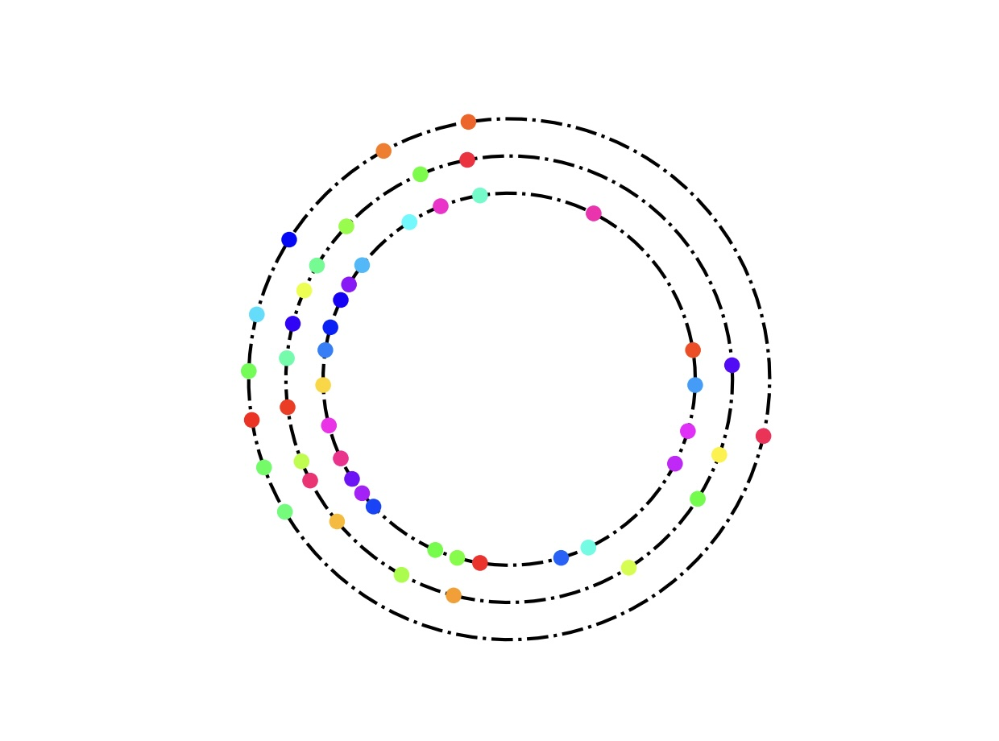

# Multi-Lane Traffic Flow Simulation

A Python-based traffic flow simulation that models vehicle behavior across multiple lanes using a cellular automaton approach. The simulation incorporates realistic driving behaviors including lane changing, speed adjustments, and random speed fluctuations.

## Features

- Multi-lane traffic simulation (supports 1-3 lanes)
- Realistic vehicle behavior modeling:
  - Lane changing based on traffic conditions
  - Speed adjustments based on surrounding vehicles
  - Random speed fluctuations (to simulate real-world variations)
  - Normally distributed maximum velocities for vehicles
- Visualization options:
  - Animated visualization of traffic flow
  - Flow rate vs density plots
  - Statistical analysis tools
  - Various performance metrics

## Key Components

- `Cars`: Class managing vehicle states (position, velocity, lane)
- `Propagator`: Handles vehicle movement rules and lane changing logic
- `Simulation`: Controls simulation execution and visualization
- `Observables`: Tracks and stores simulation metrics

## Analysis Tools

The project includes several analysis functions:
- `trafficb()`: Analyzes flow-density relationships for different lane configurations
- `trafficc()`: Studies statistical error in flow measurements
- `traffice()`: Examines the effect of velocity distribution on flow rates
- `trafficf()`: Investigates the impact of road length on traffic flow

## Visualization

The simulation provides multiple visualization options:
- Real-time animated visualization of vehicles on a circular track
- Flow rate vs time plots
- Flow rate vs density plots (fundamental diagrams)
- Statistical analysis plots

## Dependencies

- NumPy
- Matplotlib
- SciPy

## Usage

Basic usage example:

Create a simulation with 100 cars
numCars = 100
speedLimit = 5
vmax = normalVelocities(numCars, speedLimit, scale=1)
cars = Cars(numCars=numCars, roadLength=200, numLanes=3, vmax=vmax)

Initialize and run simulation
sim = Simulation(cars)
sim.run_animate(propagator=Propagator(p=0.2))
